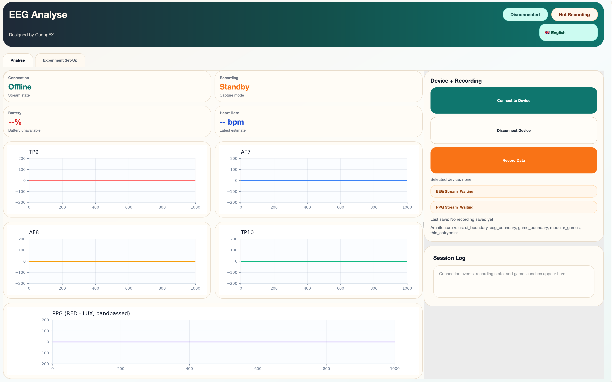
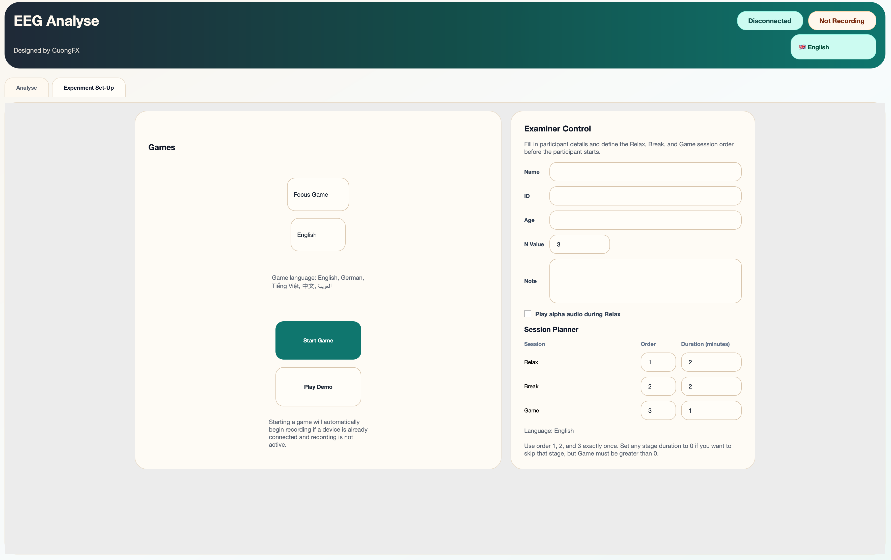

# EEG Analyse

`EEG Analyse` is a desktop software for Muse-based EEG/PPG acquisition, live signal visualization, recording, and an examiner-controlled N-back task (`Focus Game`).

## Main Features

- Connect to a Muse device directly from the app
- Start Muse EEG/PPG stream internally
- Display live EEG and PPG plots
- Record EEG and PPG to CSV
- Launch `Focus Game` with examiner setup
- Save experiment outputs and participant metadata

## Project Structure

```text
EEG/
├── UI/                  # Main desktop UI (PyQt6)
├── EEG_APP/             # Device, streaming, processing, storage
├── GAME/                # Game registry and game modules
│   └── n_back/          # Focus Game implementation
├── Archieve/            # Legacy/old scripts
└── main.py              # App entry point
```

## Requirements

- Python 3.12 (recommended)
- Muse headset
- `muselsl`
- PyQt6
- Tkinter (for game window)

## Run

From project root:

```bash
python main.py
```

## UI Overview

### Analyse Tab

The Analyse tab is for real-time monitoring and recording.



How to use:

1. Click `Connect to Device`
2. Select your Muse headset
3. Wait for stream connection
4. Monitor live EEG/PPG plots
5. Click `Record Data` to start recording
6. Click `Stop Recording` to save

### Experiment Set-Up Tab

The Experiment Set-Up tab is for game launch and examiner configuration.



How to use:

1. Select `Focus Game`
2. Choose game language
3. Enter participant fields (`Name`, `ID`, `Age`, `N`, `Note`)
4. Configure stage order and duration (`Relax`, `Break`, `Game`)
5. Launch game and run the session

## Focus Game (N-back)

In `Focus Game`, the examiner sets `N`. The player must always remember the newest `N` letters and press `SPACE` only when the current letter matches the one from `N` steps earlier.

Example (`N = 3`):

- `A, K, D, A` -> press `SPACE` on the last `A`
- `A, K, D, C` -> do not press
- then memory slides to `K, D, C`, and the rule continues

## Output Files

- EEG/PPG recordings: `EEG_APP/results/`
- Game result CSV: `GAME/n_back/result/`
- Master control workbook: `GAME/n_back/result/Master_Control.xlsx`

## License and Citation

This software is provided for research and academic use.

If you use this software, you **must cite the author** in your publication, report, thesis, or project documentation.

Recommended citation:

`Pham, M. C. EEG Analyse Software (Muse EEG/PPG acquisition and Focus Game), RPTU Kaiserslautern-Landau.`

## Author

👨‍💻 **Author**  
**Manh Cuong Pham**  
📧 pmcuong1996@icloud.com  
💼 PhD Candidate at RPTU Kaiserslautern-Landau
